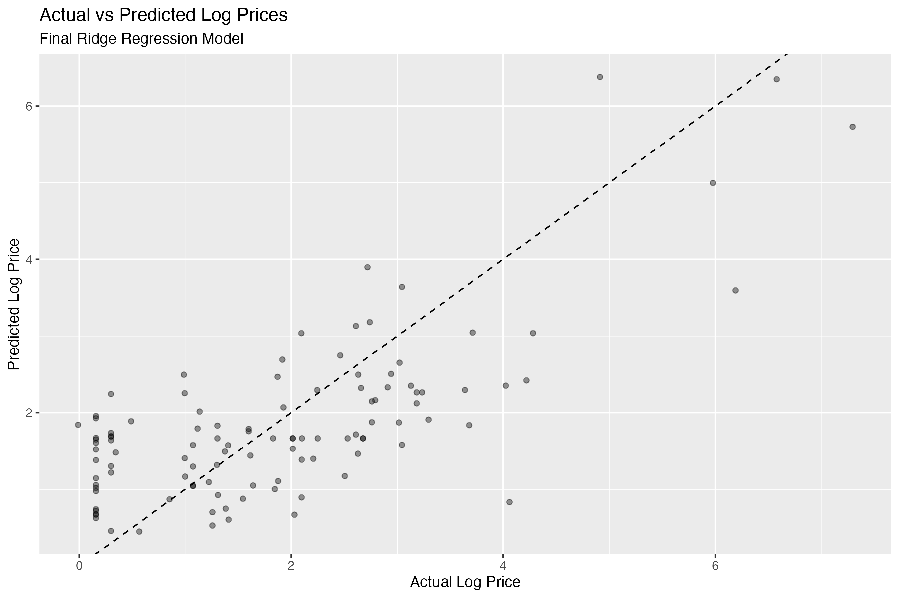
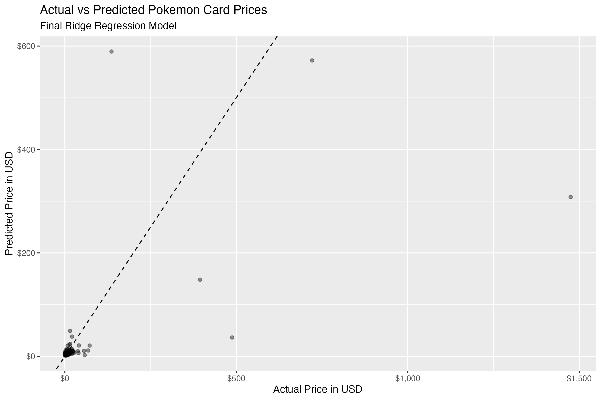
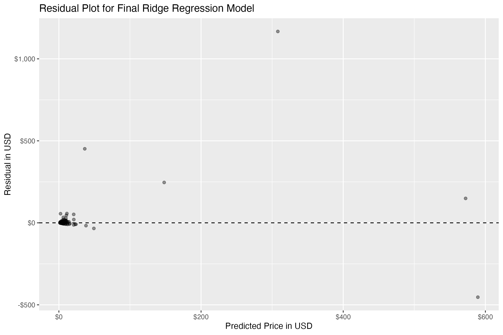

## Project 3: Pokémon Card Price Prediction

**Project Type:** Regression Modeling  
**Primary Tool:** R  
**Project Status:** Completed — Future improvements possible

### Project Overview

Project 3 is a regression modeling project titled **Pokémon Card Price Prediction: An E-Commerce Pricing Analysis in R**. This project uses a Pokémon card sales/listing dataset to examine which card and listing features are associated with market price.

The main price variable is `price_usd`, which standardizes all prices into U.S. dollars. Because card prices were highly right-skewed, the regression models used `log_price_usd` as the final response variable. The original `price` column is still useful for reference, but it depends on the listing’s original currency. For modeling and comparison, `price_usd` is the cleaner and more consistent target variable.

---

## Step 1: Data Cleaning and Preparation

The first step of this project focused on importing the raw dataset, inspecting its structure, identifying missing values, cleaning variable names, preparing important variables, and saving a cleaned version of the data for later analysis.

### 1a. Packages Used

| Package | Purpose |
|---|---|
| `tidyverse` | A collection of packages used for data cleaning, transformation, visualization, and importing data. This includes `dplyr`, `readr`, `ggplot2`, `tidyr`, `tibble`, and more. |
| `janitor` | Used for `clean_names()`, which standardizes column names into clean `snake_case` format. |
| `skimr` | Used for `skim()`, which gives a detailed summary of variables, missing values, and distributions. |

### 1b. Important Functions Used

| Package | Functions Used |
|---|---|
| `readr` | Used to read CSV files. The function `read_csv()` comes from `readr`, which is included in the `tidyverse`. |
| `dplyr` | Used for data cleaning verbs such as `filter()`, `mutate()`, `distinct()`, `summarise()`, and `arrange()`. |
| `tidyr` | Used for reshaping data. The function `pivot_longer()` was used to convert the missing value summary into a readable format. |
| `ggplot2` | Not heavily used in Step 1, but it will be used in later visualization steps. |

### 1c. Loading the Data

The dataset successfully loaded with **542 rows** and **32 columns**. This is enough data for a regression modeling project. The dataset includes card features, listing features, price variables, and sale-related fields.

### 1d. Cleaning Column Names

The function `clean_names()` was used to make column names easier to use in R. This function converts names into consistent `snake_case` formatting.

This step helps prevent problems caused by spaces, capital letters, punctuation, and inconsistent naming conventions.

### 1e. Important Variables

| Variable | Description |
|---|---|
| `price_usd` | Main target variable for modeling. This is the standardized card price in U.S. dollars. |
| `log_price_usd` | Created variable. This is the log-transformed version of `price_usd`, which may be better for regression modeling. |
| `rarity_class` | Card rarity category. This is a useful predictor. |
| `condition_std` | Standardized card condition. This is a useful predictor. |
| `is_graded` | Indicates whether a card is graded. This is a useful predictor. |
| `numeric_grade` | Numeric grade for graded cards. This is missing for most ungraded cards. |
| `grading_company` | Company that graded the card. This is missing for most ungraded cards. |
| `language` | Card language. This is a useful predictor. |
| `seller_country` | Seller location. This may be a useful listing-related predictor. |
| `seller_listing_count` | Number of listings from the seller. This may represent seller activity. |
| `is_holo`, `is_full_art`, `is_promo`, etc. | Binary card feature indicators. These are useful predictors. |

### 1f. Creating a Missing Value Summary

Before modeling, it is important to understand where values are missing. Missing data affects how the dataset should be cleaned and which variables can be safely used in modeling.

The object `missing_summary` shows which variables have missing values and how many values are missing for each variable.

### 1g. Results of `missing_summary`

| Variable | Missing Count | Interpretation |
|---|---:|---|
| `numeric_grade` | 512 | Most cards are not graded, so missing numeric grades are expected. |
| `grading_company` | 503 | Most cards are ungraded, so missing grading companies are expected. |
| `card_number` | 131 | Some listings do not include a card number. This column can be kept, but it should not be used as a main predictor. |
| `days_since_sold` | 4 | Only 4 values are missing. It is reasonable to fill these with the median for this project. |
| `sale_month` | 4 | Only 4 values are missing. It is reasonable to fill these with the median. |
| `sale_year` | 4 | Only 4 values are missing. It is reasonable to fill these with the median. |

Rows should not be deleted just because `numeric_grade` or `grading_company` is missing. In this dataset, those missing values usually mean the card is ungraded, not that the data is unusable.

### 1h. Removing Duplicate Rows

Duplicate rows can cause repeated listings to be counted more than once. I used the function `distinct()` to remove exact duplicate rows.

This helps ensure that repeated records do not distort summary statistics, visualizations, or regression results.

### 1i. Choosing the Target Variable

The modeling target for this project is `price_usd`. This is better than using the original `price` column because the original price depends on the listing currency. Since the dataset includes multiple currencies, `price_usd` creates a fairer and more consistent comparison across listings.

I also created `log_price_usd` because collectible card prices are usually right-skewed. This means many cards have lower prices, while a smaller number of cards are much more expensive. A log transformation can make the distribution easier to model with linear regression.

### 1j. Handling Missing Values

Missing values were handled based on what they likely mean in the real world, rather than deleting rows automatically.

#### Grading Variables

For `grading_company`, missing values were changed to `"Ungraded"`. This preserves useful information because an ungraded card is meaningfully different from a graded card in terms of price and collectibility.

For `numeric_grade`, missing values were changed to `0`. This tells the model that ungraded cards do not have a numeric grade. This works because the dataset also includes `is_graded`, which separates graded cards from ungraded cards.

#### Date-Related Variables

For `days_since_sold`, `sale_month`, and `sale_year`, only 4 values were missing from the dataset. Filling these values with the median is reasonable for this project because it avoids losing rows over a very small amount of missing data.

### 1k. Converting Variable Types

Some columns are categories, not true numeric measurements. For example, `rarity_class`, `language`, `condition_std`, and `seller_country` should be treated as categorical variables.

Binary indicators such as `is_holo`, `is_promo`, `is_full_art`, and `is_graded` were also converted to factors for easier modeling and interpretation.

### 1l. Checking That Missing Value Fixes Worked

After handling missing values, I checked that key variables no longer had missing values. These checks returned `0`, which means the cleaning process worked for those variables.

The variables checked were:

- `numeric_grade`
- `grading_company`
- `days_since_sold`

### Step 1 Output

The cleaned dataset was saved to:

```text
data/cleaned/pokemon_card_pricing_cleaned_initial.csv
```

This cleaned file was used as the starting point for exploratory data analysis and regression modeling.


## Step 2: Exploratory Data Analysis

After cleaning the Pokémon card pricing dataset, the final analysis dataset contained **541 observations** and **33 variables**. The dataset included a mix of categorical card attributes, numeric listing features, and engineered indicator variables such as whether a card was graded, holo, full art, promo, first edition, or part of a special card category.

### 2a. Price Distribution

The raw `price_usd` variable was highly right-skewed. Most cards were listed or sold at relatively low prices, while a smaller number of high-value cards created a long right tail in the distribution.

The summary statistics showed:

| Statistic | Price USD |
|---|---:|
| Minimum | $0.49 |
| 1st Quartile | $2.04 |
| Median | $5.37 |
| Mean | $39.90 |
| 3rd Quartile | $15.20 |
| Maximum | $1,591.00 |

The large difference between the median price and mean price shows that a small number of expensive cards strongly influenced the average. Because of this skew, I used the natural log of price, `log_price_usd`, as the target variable for regression modeling. The log transformation made the price distribution more suitable for linear modeling by reducing the effect of extreme high-value observations.

### 2b. Rarity and Price

Rarity class showed a clear relationship with card value. Higher-rarity cards generally had much higher median prices than common or uncommon cards.

| Rarity Class | Count | Median Price USD | Mean Price USD |
|---|---:|---:|---:|
| HR | 1 | $449.00 | $449.00 |
| SAR | 7 | $235.00 | $366.00 |
| SIR | 6 | $73.70 | $162.00 |
| SR | 7 | $19.00 | $155.00 |
| IR | 19 | $10.90 | $14.20 |
| Rare Holo | 37 | $10.10 | $25.90 |
| Rare | 55 | $6.87 | $40.70 |
| Common | 10 | $2.51 | $4.29 |
| Uncommon | 7 | $1.35 | $3.46 |

These results suggest that rarity is an important predictor of Pokémon card price. However, some rarity groups had small sample sizes, so results for rare categories such as HR should be interpreted cautiously.

### 2c. Condition and Grading

Condition and professional grading status also appeared to be strongly related to card value. Graded cards had substantially higher median prices than raw cards listed as Near Mint, Excellent, Lightly Played, or Very Good.

| Condition | Count | Median Price USD | Mean Price USD |
|---|---:|---:|---:|
| BGS | 4 | $885.00 | $870.00 |
| PSA 9 | 1 | $721.00 | $721.00 |
| PSA 10 | 8 | $289.00 | $301.00 |
| ACE 10 | 10 | $57.00 | $72.70 |
| CGC | 5 | $45.70 | $103.00 |
| ACE 9 | 11 | $34.00 | $33.00 |
| Near Mint | 397 | $6.23 | $30.90 |
| Excellent | 81 | $2.35 | $3.40 |
| Lightly Played | 7 | $1.35 | $18.80 |
| Very Good | 17 | $1.17 | $42.00 |

This supports including grading-related variables such as `is_graded`, `grading_company`, and `numeric_grade` in the regression model. As with rarity, some grading categories had small sample sizes, so those results should be interpreted as exploratory rather than definitive.

### 2d. Correlation Analysis

A correlation analysis was conducted using the numeric variables and the log-transformed price target. The strongest positive numeric relationship with `log_price_usd` was `is_graded`, followed by `numeric_grade`. This indicates that graded cards and cards with higher numeric grades tend to have higher prices.

Some of the strongest correlations with `log_price_usd` were:

| Variable | Correlation with `log_price_usd` |
|---|---:|
| `is_graded` | 0.471 |
| `numeric_grade` | 0.381 |
| `image_count` | 0.214 |
| `is_gold` | 0.185 |
| `days_since_sold` | 0.180 |
| `seller_listing_count` | -0.333 |
| `ships_worldwide` | -0.251 |

The negative correlations for `seller_listing_count` and `ships_worldwide` may suggest that cards from larger-volume sellers or listings with worldwide shipping were associated with lower prices in this dataset. These relationships may reflect seller behavior, card availability, or listing strategy rather than direct causal effects.

### 2e. Key EDA Takeaways

The exploratory analysis showed that Pokémon card prices are influenced by a combination of collectible features, condition, grading, and listing characteristics. The most important early findings were:

- Pokémon card prices were highly right-skewed, making log transformation necessary for regression modeling.
- Rarity class was strongly associated with price, with higher-rarity cards generally selling for more.
- Professionally graded cards had much higher prices than raw condition cards.
- `is_graded` and `numeric_grade` were among the strongest numeric predictors of log-transformed price.
- Some high-value categories had small sample sizes, so model results should be interpreted with caution.

Based on these findings, the regression model uses `log_price_usd` as the target variable and excludes direct price-derived variables such as `price`, `price_usd`, and `price_tier_usd` to avoid data leakage.

## Step 3: Baseline Regression Model

After completing exploratory data analysis, I built a baseline linear regression model to predict Pokémon card prices. Because the raw price variable was highly right-skewed, the model used `log_price_usd` as the target variable instead of raw `price_usd`.

### 3a. Modeling Approach

The dataset was split into an 80% training set and a 20% testing set. A baseline linear regression model was fit using the `tidymodels` framework in R.

To avoid data leakage, direct price-related variables were removed from the predictor set:

- `price`
- `price_usd`
- `price_tier_usd`
- `currency`

Additional high-cardinality or less useful baseline fields such as `title` and `card_number` were also removed before modeling.

The preprocessing recipe included:

- grouping rare categorical levels with `step_other()`
- handling unknown categorical values with `step_unknown()`
- creating dummy variables for categorical predictors with `step_dummy()`
- removing zero-variance predictors with `step_zv()`
- normalizing numeric predictors with `step_normalize()`

### 3b. Baseline Model Performance

The baseline linear regression model was evaluated on the test set.

| Metric | Value |
|---|---:|
| RMSE, log scale | 1.11 |
| MAE, log scale | 0.894 |
| R-squared | 0.568 |
| RMSE, USD scale | $114.00 |
| MAE, USD scale | $32.60 |
| Mean actual test price | $61.00 |
| Median actual test price | $6.11 |

The model explained approximately **56.8% of the variation in log-transformed card prices**. This suggests that the available card characteristics, grading information, rarity indicators, and seller/listing features contain meaningful predictive information.

However, prediction error on the dollar scale was heavily affected by high-value outliers. The test set had a median actual price of only **$6.11**, but the mean actual price was **$61.00**, showing that a small number of expensive cards strongly influenced dollar-scale error metrics such as RMSE.

### 3c. Model Interpretation

The baseline model performed better on the log-transformed price scale than on the raw dollar scale. This supports the decision to model `log_price_usd`, since Pokémon card prices are highly skewed and include extreme high-value observations.

The actual vs. predicted log-price plot showed a moderate positive relationship between observed and predicted values, but the model still struggled with some high-value cards. The dollar-scale prediction plot and residual plot showed that prediction errors were largest for expensive cards, which is expected in a collectibles pricing dataset with large price variation.

### 3d. Baseline Model Limitations

This model should be interpreted as a baseline rather than a final predictive model. Some limitations include:

- High-value cards created large residuals on the dollar scale.
- Some rare categories had small sample sizes.
- Several grading-related variables overlap with each other, which can cause instability in ordinary linear regression coefficients.
- Linear regression may not fully capture nonlinear relationships between rarity, grading, seller behavior, and price.

During model fitting, the linear model produced a rank-deficiency warning, which suggests that some predictors were redundant after dummy encoding. This is likely due to overlap between variables such as `is_graded`, `numeric_grade`, `grading_company`, and `condition_std`.

### ### 3e. Transition to Model Comparison

Because the baseline linear regression model showed useful but imperfect predictive performance, I next compared it against regularized and nonlinear models. This allowed me to evaluate whether Ridge regression, Lasso regression, or Random Forest regression could improve prediction accuracy.

## Step 4: Model Comparison

After building the baseline linear regression model, I compared several regression approaches to evaluate whether regularized or nonlinear models could improve prediction performance.

The models compared were:

- Linear regression
- Ridge regression
- Lasso regression
- Random forest regression

Each model was evaluated using test set performance on the log-transformed target variable, `log_price_usd`.

| Model | RMSE | MAE | R-squared |
|---|---:|---:|---:|
| Ridge Regression | 1.02 | 0.846 | 0.524 |
| Linear Regression | 1.06 | 0.866 | 0.532 |
| Lasso Regression | 1.06 | 0.865 | 0.487 |
| Random Forest | 1.08 | 0.852 | 0.472 |

Ridge regression produced the lowest RMSE and MAE, making it the strongest overall predictive model in this comparison. Although the ordinary linear regression model had a slightly higher R-squared value, Ridge regression had better prediction error metrics, which were prioritized for model selection.

The best Ridge model used a penalty value of `0.418`.

### 4a. Final Model Selection

Ridge regression was selected as the preferred model because it performed best on prediction error while also addressing an important limitation of ordinary linear regression: correlated predictors. Several variables in the dataset describe overlapping pricing signals, especially grading-related fields such as `is_graded`, `numeric_grade`, `grading_company`, and `condition_std`.

Because Ridge regression shrinks coefficients rather than removing them entirely, it is useful when many predictors may contribute some information but are correlated with each other. This made Ridge a strong fit for the Pokémon card pricing dataset.

### 4b. Model Comparison Takeaways

The model comparison showed that:

- Ridge regression had the best overall prediction accuracy based on RMSE and MAE.
- Linear regression remained competitive but was more vulnerable to unstable coefficients.
- Lasso regression did not improve performance, suggesting that completely removing predictors was not as helpful for this dataset.
- Random forest did not outperform the linear or regularized models, possibly because the dataset was relatively small and contained many sparse categorical levels.

Overall, the results suggest that a regularized linear model is a strong choice for this pricing prediction problem.

## Step 5: Final Ridge Regression Model

Ridge regression was selected as the final model because it produced the best overall prediction error during model comparison. The final model used `log_price_usd` as the target variable and excluded direct price-derived variables such as `price`, `price_usd`, and `price_tier_usd` to prevent data leakage.

### 5a. Final Model Performance

| Metric | Value |
|---|---:|
| RMSE, log scale | 1.022 |
| MAE, log scale | 0.846 |
| R-squared | 0.524 |
| RMSE, USD scale | $130.47 |
| MAE, USD scale | $29.52 |
| Mean actual test price | $39.16 |
| Median actual test price | $5.70 |

The final Ridge model explained approximately **52.4% of the variation in log-transformed Pokémon card prices**. This indicates that rarity, condition, grading information, seller characteristics, and card-level features contain meaningful predictive information.

The model performed better on the log-transformed price scale than on the raw dollar scale. This is expected because Pokémon card prices were highly right-skewed, with most cards selling at relatively low prices and a small number of high-value cards creating large prediction errors.

### 5b. Prediction Diagnostics



The log-scale actual vs. predicted plot shows a clearer positive relationship between observed and predicted prices. This supports the decision to use `log_price_usd` as the modeling target.



The dollar-scale actual vs. predicted plot shows that most observations are clustered near lower prices, while a small number of expensive cards dominate the scale. These high-value cards are harder for the model to predict accurately.



The residual plot shows that prediction errors are generally smaller for low-price cards and much larger for high-value cards. This suggests that the model captures common lower-priced listings better than rare or unusually expensive collectibles.

### 5c. Final Model Takeaway

The Ridge regression model provided a strong final baseline for this project. It improved prediction error compared with ordinary linear regression and handled correlated predictors more effectively. However, the model still struggled with high-value outliers, suggesting that future improvements could include additional card-specific market features, larger sample sizes, or more advanced nonlinear modeling approaches.

## Conclusion

This project used regression modeling to predict Pokémon card prices from card attributes, rarity, condition, grading information, seller characteristics, and listing features. Exploratory analysis showed that card prices were highly right-skewed, so the final models used `log_price_usd` as the response variable.

After comparing linear regression, Ridge regression, Lasso regression, and Random Forest regression, Ridge regression was selected as the final model because it produced the lowest RMSE and MAE on the test set. The final model explained approximately 52.4% of the variation in log-transformed card prices.

The model performed best for lower-priced cards and struggled more with rare, high-value cards. This suggests that future improvements could include a larger dataset, more detailed card metadata, population/grading data, set popularity, character popularity, or historical market demand features.

## Skills Demonstrated

- Data cleaning and preprocessing in R
- Exploratory data analysis
- Feature engineering
- Log transformation for skewed response variables
- Train/test splitting
- Cross-validation
- Linear regression
- Ridge regression
- Lasso regression
- Random Forest regression
- Model comparison using RMSE, MAE, and R-squared
- Prediction diagnostics and residual analysis
- GitHub project organization

## Data Dictionary

A project data dictionary is included in the repository to document variable names, descriptions, and modeling relevance.

[View Data Dictionary](outputs/tables/data_dictionary.md)
