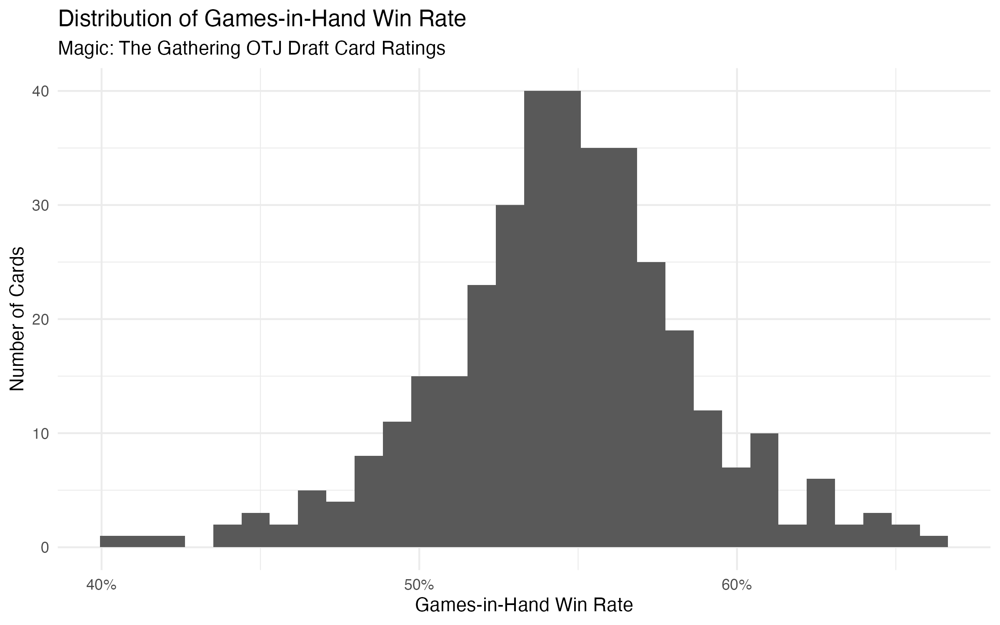
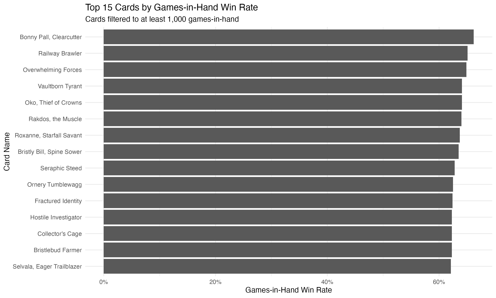
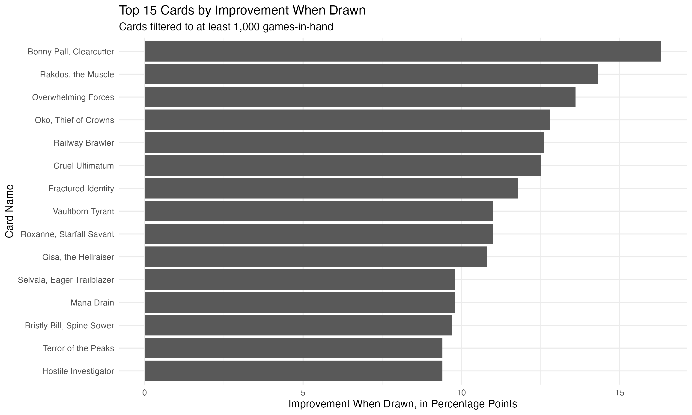
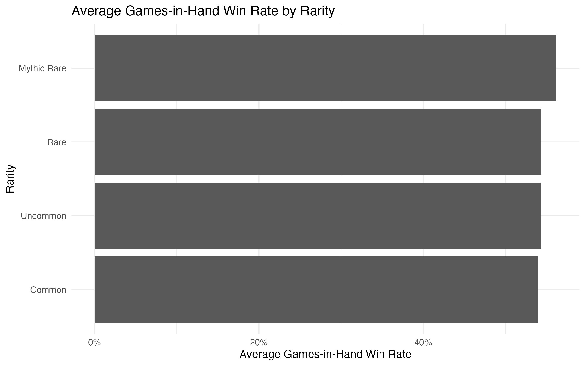
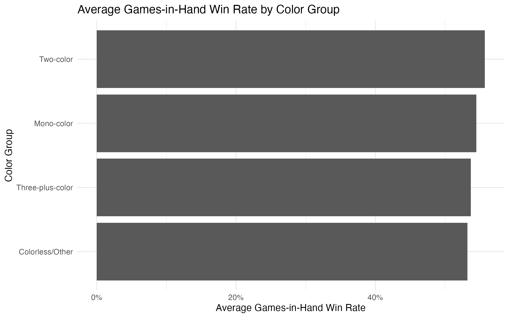
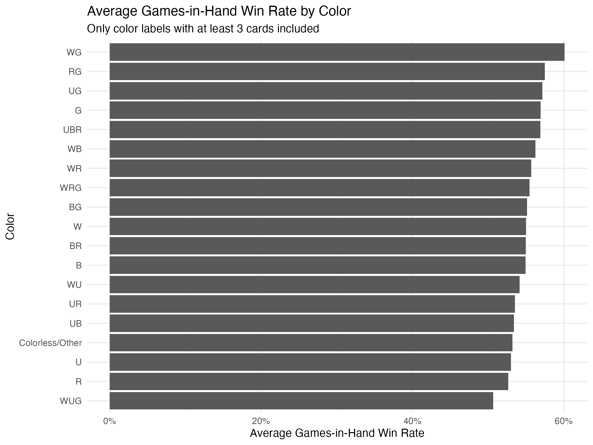
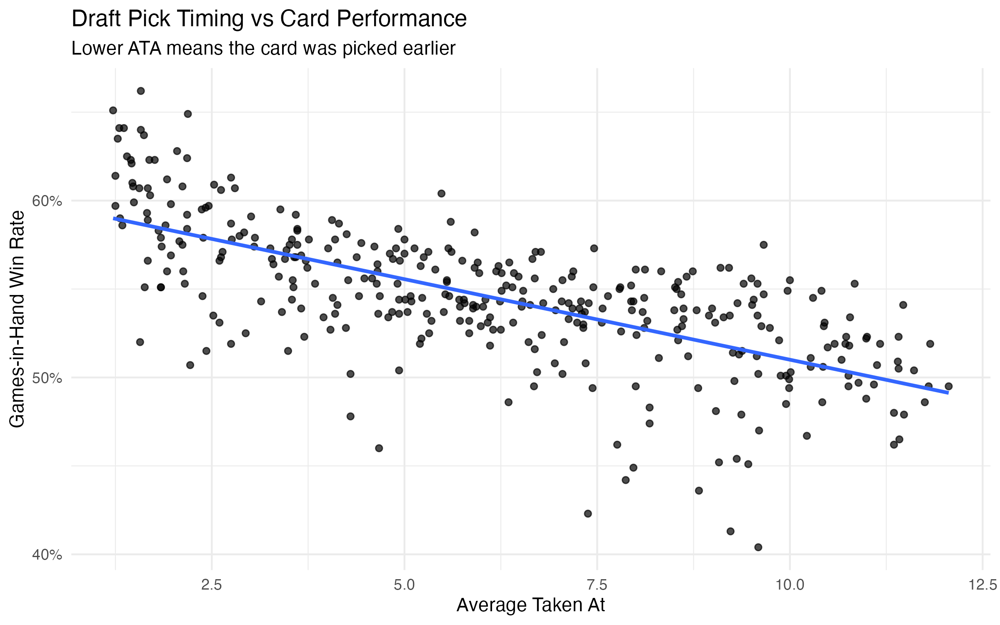
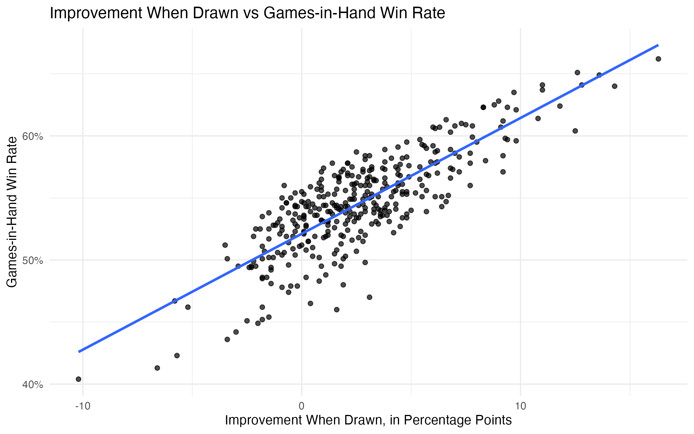

## Project 4: Magic: The Gathering Ratings Analysis

**Project Type:** EDA  
**Primary Tool:** R  
**Project Status:** Completed — Future improvements possible

## Data Dictionary

This dataset contains card-level draft performance data for Magic: The Gathering cards from the *Outlaws of the Thunder Junction* set. The table below lists each variable, its shorthand meaning, and how it was used in the analysis.

| Raw Variable | Cleaned Variable | Shorthand / Full Name | Meaning |
|---|---|---|---|
| `Name` | `name` | Card Name | The name of the Magic: The Gathering card. |
| `Color` | `color` | Color | The card's color or color combination. Examples include `W`, `U`, `B`, `R`, `G`, `WU`, `BR`, and `UG`. Missing color values were labeled as `Colorless/Other`. |
| `Rarity` | `rarity` | Rarity | The card's rarity abbreviation. `C` = Common, `U` = Uncommon, `R` = Rare, and `M` = Mythic Rare. |
| `# Seen` | `number_seen` | Number Seen | The number of times the card was seen in draft packs. |
| `ALSA` | `alsa` | Average Last Seen At | The average pick position where the card was last seen in a draft pack. Lower ALSA values generally mean the card was taken earlier and was less likely to be passed around the table. |
| `# Picked` | `number_picked` | Number Picked | The number of times the card was selected by players during drafts. |
| `ATA` | `ata` | Average Taken At | The average pick position where the card was taken. Lower ATA values mean the card was drafted earlier. |
| `# GP` | `number_gp` | Number of Games Played | The number of games where the card was included in a player's deck. |
| `% GP` | `percent_gp` | Percent Games Played | The percentage of drafted copies that were included in decks and played in games. |
| `GP WR` | `gp_wr` | Games Played Win Rate | The win rate in games where the card was included in the player's deck. |
| `# OH` | `number_oh` | Number in Opening Hand | The number of games where the card appeared in the player's opening hand. |
| `OH WR` | `oh_wr` | Opening Hand Win Rate | The win rate in games where the card was in the player's opening hand. |
| `# GD` | `number_gd` | Number of Games Drawn | The number of games where the card was drawn at some point during the game. |
| `GD WR` | `gd_wr` | Games Drawn Win Rate | The win rate in games where the card was drawn. |
| `# GIH` | `number_gih` | Number of Games in Hand | The number of games where the card was either in the opening hand or drawn later in the game. |
| `GIH WR` | `gih_wr` | Games-in-Hand Win Rate | The win rate in games where the card was seen in hand, either from the opening hand or drawn during the game. This was one of the main performance metrics used in this project. |
| `# GNS` | `number_gns` | Number of Games Not Seen | The number of games where the card was in the deck but was never drawn or seen in hand. |
| `GNS WR` | `gns_wr` | Games Not Seen Win Rate | The win rate in games where the card was in the deck but was not drawn or seen. |
| `IWD` | `iwd` | Improvement When Drawn | The difference between `GIH WR` and `GNS WR`, measured in percentage points. Higher values suggest the card had a stronger positive impact when drawn. |

## Created Variables

The following variables were created during the data cleaning process to make the analysis easier to interpret.

| Created Variable | Meaning |
|---|---|
| `color_group` | A broader color category used for grouped analysis. Cards were classified as `Mono-color`, `Two-color`, `Three-plus-color`, or `Colorless/Other`. |
| `rarity_full` | A full-text rarity label created from the original rarity abbreviation. For example, `C` became `Common`, `U` became `Uncommon`, `R` became `Rare`, and `M` became `Mythic Rare`. |

## Color Shorthand

| Shorthand | Meaning |
|---|---|
| `W` | White |
| `U` | Blue |
| `B` | Black |
| `R` | Red |
| `G` | Green |
| `WU` | White / Blue |
| `WB` | White / Black |
| `WR` | White / Red |
| `WG` | White / Green |
| `UB` | Blue / Black |
| `UR` | Blue / Red |
| `UG` | Blue / Green |
| `BR` | Black / Red |
| `BG` | Black / Green |
| `RG` | Red / Green |
| `Colorless/Other` | Colorless cards, lands, or cards without a standard color label |

## Rarity Shorthand

| Shorthand | Meaning |
|---|---|
| `C` | Common |
| `U` | Uncommon |
| `R` | Rare |
| `M` | Mythic Rare |

## Main Metrics Used in This Project

| Metric | Why It Matters |
|---|---|
| `gih_wr` | Used as the main card performance metric because it measures win rate when the card was actually seen in hand. |
| `iwd` | Used to measure how much a card improved win rate when drawn compared with games where it was not seen. |
| `ata` | Used to understand draft behavior. Lower ATA values mean the card was picked earlier. |
| `alsa` | Used to understand how long cards stayed available in draft packs. Lower ALSA values usually suggest stronger player demand. |
| `rarity_full` | Used to compare average performance across rarity groups. |
| `color_group` | Used to compare performance across broad color categories. |
| `color` | Used to compare individual colors and color combinations. |

## Project Summary: Magic: The Gathering Draft Card Ratings Analysis

This project analyzed Magic: The Gathering card performance data from *Outlaws of the Thunder Junction* draft format. The main goal for this project was to understand which cards, colors, rarity groups, and draft behaviors were associated with stronger limited format performance.

The dataset contained 376 unique cards and included draft related metrics such as how often cards were seen, picked, played, drawn, and how often they were associated with player wins. The project was completed as an exploratory data analysis project in R, using data cleaning, summary statistics, grouped comparisons, correlations, and visualizations. 

## METHODOLOGY
The project started by importing and cleaning the raw Kaggle dataset. Column names were standardized, percentage based variables were converted from text into numeric values, missing color values were labeled Colorless/Other, and new grouping variables were created for color group and rarity group.

### After cleaning, the project analyzed: 
- Card performance by games-in-hand win rate
-  Card impact by improvement when drawn
-  Performance by rarity
-  Performance by color and color group
-  Draft behavior using ATA and ALSA
-  Relationships between draft timing and win-rate performance

Several output tables and charts were created, including top performing cards, lowest performing cards, performance by rarity, performance by color, correlation summaries, visualizations showing distributions and relationships between key variables.

## PURPOSE
The main purpose was to find patterns in card strength and draft performance. 

### Specifically, the project looked for: 
-  Which cards performed best overall
-  Which cards improved win rate the most when drawn
-  Whether rarity was related to stronger performance
-  Whether certain colors or color combinations performed better
-  Whether cards picked earlier in drafts also had higher win rates
-  Whether IWD and GIH WR were strongly related

The project focused heavily on games in hand win rate (GIH WR), because it is one of the most useful performance metrics for limited card evaluation. It also used improvement when drawn (IWD), to measure how much a card improved a deck's win rate when it was actually seen during a game.

## FINDINGS
The final cleaned dataset included 376 unique cards. The average GIH WR was about 54.5%, and the median was about 54.4%. The average IWD was +2.59 percentage points, meaning that, on average, cards improved game outcomes when drawn. 

The strongest overall card was Bonny Pall, Clearcutter. It had the highest GIH WR at 66.2% and the highest IWD at +16.3 percentage points. This made it the clearest top performer in the dataset.

Rarity was also connected to performance. Mythic rares had the highest average GIH WR at 56.2%, along with the highest average improvement when drawn at +4.95 percentage points. This suggests that higher rarity cards tended to be stronger and more impactful in this draft format.

Color also showed meaningful differences. Two color cards had the highest average GIH WR at 55.7%, and green based color combinations performed especially well. Among individual color labels, WG, RG, and UG were among the strongest groups.

The correlation results showed that IWD and GIH WR had a strong positive relationship, with a correlation of about 0.82. This means cards that improved win rate more when drawn also tended to have higher overall games in hand win rates.

There was also a strong negative relationship between ATA and GIH WR, with a correlation of about -0.68. Since lower ATA means a card was picked earlier, this suggests that cards drafted earlier generally performed better. In other words, this means that players were often correctly identifying strong cards during drafts.

## Key Visualizations

### Distribution of Games-in-Hand Win Rate

Most cards fall between roughly 50% and 58% games-in-hand win rate, with a smaller number of cards performing much higher or lower than the main group.

### Top Cards by Games-in-Hand Win Rate

The top-performing cards by GIH WR were mostly rare and mythic rare cards. **Bonny Pall, Clearcutter** had the highest games-in-hand win rate in the dataset.

### Top Cards by Improvement When Drawn

Improvement when drawn shows which cards had the largest positive impact when they were seen during games. **Bonny Pall, Clearcutter** also ranked highest by this metric.

### Average GIH WR by Rarity

Mythic rares had the highest average games-in-hand win rate, followed by rares, uncommons, and commons. This suggests that rarity was meaningfully related to card strength in this draft environment.

### Average GIH WR by Color Group

Two-color cards had the highest average games-in-hand win rate. Mono-color cards were close behind, while three-plus-color and colorless/other cards had slightly lower averages.

### Average GIH WR by Individual Color

Among color labels with at least three cards, **WG**, **RG**, and **UG** had the strongest average games-in-hand win rates. Mono-green also performed strongly.

### Draft Pick Timing vs Card Performance

The scatterplot shows a negative relationship between ATA and GIH WR. Since lower ATA means a card was picked earlier, this suggests that cards drafted earlier tended to perform better.

### Improvement When Drawn vs Games-in-Hand Win Rate

Improvement when drawn had a strong positive relationship with games-in-hand win rate. Cards that improved win rate more when drawn also tended to have higher overall GIH WR.

